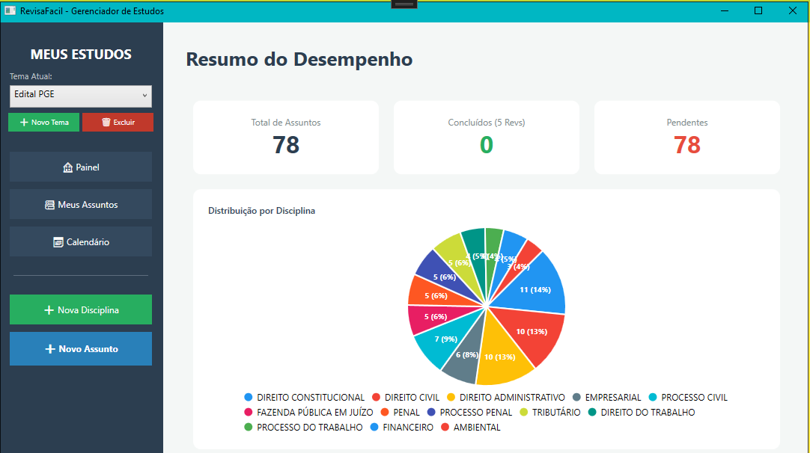
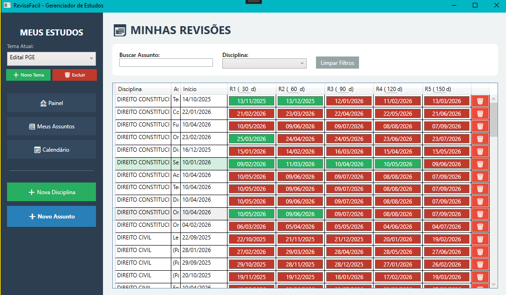
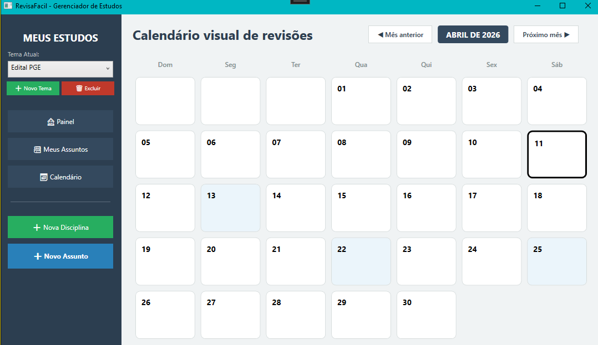

# RevisaFácil


**RevisaFácil** é um gestor de estudos inteligente desenvolvido para Windows, focado na fixação de conteúdo por meio de ciclos de revisão automatizados. Ideal para concurseiros e estudantes de Direito que precisam dominar grandes volumes de matérias com precisão e método.

O sistema substitui planilhas complexas, automatizando o cálculo de prazos e oferecendo lembretes ativos via Telegram.

---

## Demonstração

### Dashboard Principal


### Gestão de Assuntos e Revisões


### Calendário de Estudos Interativo


---

## Funcionalidades

- **Ciclos de Revisão Automatizados:** Calcula automaticamente as revisões de 30, 60, 90, 120 e 150 dias.
- **Calendário Dinâmico:** Interface moderna para anotações diárias com cards coloridos que indicam atividades e limpeza automática de registros vazios.
- **Painel de Desempenho:** Gráficos interativos (**LiveCharts**) com distribuição de assuntos por disciplina.
- **Alertas via Telegram:** Integração com **Telegram.Bot API** para notificar revisões pendentes ou atrasadas.
- **Personalização de Intervalos:** Altere os dias de revisão diretamente no cabeçalho com persistência automática no SQLite.
- **UX de Alta Performance:** Operações rápidas via teclado (Enter para salvar) e cliques inteligentes para destaque de linhas.

## 🛠️ Tecnologias Utilizadas

- **Linguagem:** C# 12
- **Framework:** .NET 8 (WPF)
- **Banco de Dados:** SQLite com Entity Framework Core 8
- **Recursos Avançados:** Lazy Loading Proxies, CommunityToolkit.Mvvm
- **Integrações:** Telegram.Bot API, LiveCharts.Wpf

## Estrutura do Projeto

- `Data/`: Contexto do banco de dados e configurações Fluent API.
- `Models/`: Entidades (Disciplina, Assunto, NotaCalendario, Configuracao).
- `Views/`: Interfaces XAML e Code-behind (Pages e Windows).
- `Helpers/`: Conversores de UI (Converters) e lógica de temas.
- `Services/`: Serviços de notificação e lógica de negócio externa.

## Como Executar

1. **Clone o repositório:**
   ```bash
   git clone [https://github.com/josecarlossouza/RevisaFacil.git](https://github.com/josecarlossouza/RevisaFacil.git)
   ```

2. Certifique-se de ter o SDK do .NET 8 instalado.

3. Abra o arquivo RevisaFacil.sln no Visual Studio 2022.

4. Restaure os pacotes NuGet.

5. Pressione F5 para compilar e rodar.


Desenvolvido por Jose Carlos da Silva Souza
